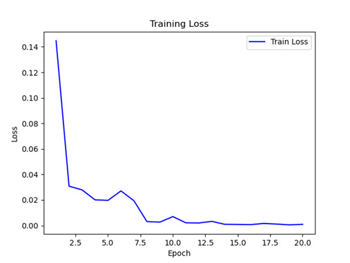
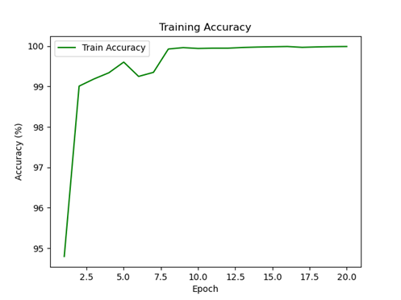

# 🧠 Fault Pattern Recognition & Image-Based Fault Intensity Classification Using Deep Learning

This project investigates how **image faults (blur)** affect **object detection confidence** in YOLOv8 and develops a **deep learning model** to classify **fault intensity**.

It was completed as part of the *Studienarbeit* at the **University of Siegen (Chair of Reliability of Technical Systems & Electrical Measurement)**.

---

## 📘 Overview

Autonomous vehicles rely heavily on camera-based perception. Environmental effects such as **blur**, **fog**, or **rain** can degrade image quality and reduce the reliability of detection models.  
This project focuses on **blur faults** to study:

1. How YOLOv8 detection confidence changes with increasing blur.  
2. How a CNN (ResNet-18) can automatically classify the **intensity** of such image faults.

---

## 🧾 Dataset

**Dataset:** [Cat Dataset (Kaggle)](https://www.kaggle.com/datasets/crawford/cat-dataset) 🐈 
- Total images: **9,993**  
- Each image was replicated across 4 blur categories (`no_fault`, `blur_low`, `blur_medium`, `blur_extreme`)  
- Total after fault injection: **≈ 39,972 images**

This dataset was selected for its visual diversity, which helped evaluate YOLO’s confidence stability across varied lighting and composition.

<p align="center">
  
  <br>
  <em>Figure 1: Examples of no-fault and blur-injected images used in this study.</em>
</p>

---

## ⚙️ Phase 1 — YOLOv8 Fault Analysis

Phase 1 analyzes YOLOv8’s behavior on **fault-injected images** to reveal confidence degradation and model sensitivity.

### 🧰 Fault Injection Process
To simulate realistic sensor faults, a **Python-based Fault-Injection Tool** was used:  
➡️ **GitHub:** (https://github.com/omarazeez90/Faults-injecting-tool)

- The tool applies **Gaussian blur** with different kernel sizes to generate three blur intensities:
  - `blur_low`
  - `blur_medium`
  - `blur_extreme`
- Each clean image was duplicated across these categories plus the original (`no_fault`), producing **39,972 images** in total.

---

### 🧩 Object Detection Pipeline

* **Model:** [YOLOv8n](https://github.com/ultralytics/ultralytics) (Nano variant – lightweight & real-time)
* **Framework:** PyTorch (via Ultralytics API)
* **Pre-trained Weights:** COCO dataset (80 classes)

Each image category (`no_fault`, `blur_low`, `blur_medium`, `blur_extreme`) was processed with YOLOv8n.
For each image, detection results (class + confidence) were saved to JSON and Excel for analysis.

```python
from ultralytics import YOLO
model = YOLO("yolov8n.pt")

results = model("data/blur_low/cat_001.jpg")
results.save("outputs/blur_low/")
```

---

### 📊 Post-Processing and Pattern Recognition

Detection confidences for the **target class “cat”** were extracted and compared across fault levels.
Images were grouped into **7 behavioral cases**, e.g.:

* **Case 1:** No detection after minimal blur (high fault sensitivity)
* **Case 2:** Gradual, expected confidence drop (robust behavior)
* **Case 3:** Confidence increases under blur (anomalous behavior)
* *(Cases 4–7 cover other intermediate or reversed trends)*

These cases expose how lightweight YOLO models may over- or under-react to degraded visuals, affecting safety in real-world applications.

---

## 🔍 Phase 2 — Fault Intensity Classification

Phase 2 develops a CNN to **quantify fault intensity** based on image appearance.

### 🧠 Model

* **Backbone:** ResNet-18 (pre-trained on ImageNet)
* **Output Classes:** No Fault | Low | Medium | Extreme
* **Loss:** CrossEntropy
* **Optimizer:** Adam
* **Scheduler:** StepLR (γ = 0.1 per 7 epochs)

```python
from torchvision import models
import torch.nn as nn

model = models.resnet18(pretrained=True)
model.fc = nn.Linear(model.fc.in_features, 4)
```

Training was executed on the **Omni GPU Cluster** (University of Siegen).
The dataset was split 80 % train / 10 % val / 10 % test.

<!--  -->

<!--  -->


---

## 📊 Results Summary

| Phase                              | Model     | Highlights                                          |
| ---------------------------------- | --------- | --------------------------------------------------- |
| 1 – YOLOv8 Fault Analysis          | YOLOv8n   | 7 distinct confidence degradation patterns observed |
| 2 – Fault Intensity Classification | ResNet-18 | ~90 % validation accuracy                           |

---

## 🧠 Key Insights

* YOLOv8n shows **expected confidence decay** with blur but also anomalies (confidence spikes).
* The deep learning classifier successfully **quantifies blur severity**, enabling fault-aware perception.
* Combining detection and fault estimation improves **model reliability** in autonomous systems.

---

## 🚀 How to Run

```bash
# 1. Install dependencies
pip install ultralytics torch torchvision pandas openpyxl matplotlib

# 2. Run object detection (Phase 1)
python object_detection.py

# 3. Train blur intensity classifier (Phase 2)
python train.py

# 4. Evaluate
python test.py
```

